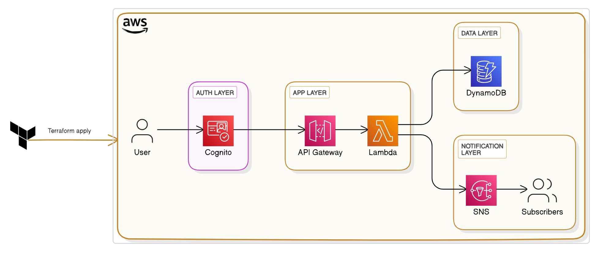

# 🛠️ Serverless Shoe Store – Terraform Edition

A **fully serverless**, event-driven e-commerce backend for managing shoe listings, built on AWS using **Terraform** to implement Infrastructure as Code (IaC). This project began with manual configuration in the AWS Console and was then refactored into a set of **clean, reusable Terraform modules**.

---

## 📦 Key Features

* 🔐 **User Authentication:** Managed by AWS Cognito, providing secure sign-up, sign-in, and token-based access control.
* 📄 **RESTful API:** Exposed via Amazon API Gateway, with Lambda functions handling business logic for Create, Read, Update, and Delete (CRUD) operations on shoe listings.
* 🧠 **Serverless Compute:** AWS Lambda functions written in Python 3.13, each with tailored IAM roles for least-privilege access.
* 📂 **NoSQL Data Storage:** Amazon DynamoDB tables for storing user profiles and shoe inventory, using on-demand billing mode.
* 📣 **Event Notifications:** Amazon SNS topics and subscriptions enable users to receive email alerts for specific shoe brands.
* 🧱 **Modular Terraform:** Infrastructure is split into logical modules (Cognito, DynamoDB, Lambda, API Gateway, SNS) for clarity, reusability, and maintainability.

---

## 🏗️ Architecture Overview



1. **User** interacts with the API client.
2. **API Gateway** receives HTTP requests, applies authorization, and routes to Lambda functions.
3. **Lambda** executes business logic and reads/writes data in DynamoDB.
4. **DynamoDB** provides scalable, low-latency NoSQL storage.
5. **SNS** handles pub/sub notifications and email delivery for brand subscriptions.

---

## 📚 Repository Structure

```text
.
├── modules/
│   ├── cognito/            # User Pool and App Client configuration
│   ├── dynamodb/           # Tables for Users and ShoeListings
│   ├── lambda/             # Functions, IAM roles, and policies
│   ├── apigateway/         # REST API, resources, methods, integrations, endpoints
│   ├── sns_topic/          # SNS topic definition for shoe alerts
│   └── sns_subscription/   # Email subscriptions with filter policies
├── main.tf                 # Root module orchestrating all sub-modules
├── variables.tf            # Input variables for root module
├── outputs.tf              # Outputs exposing ARNs and URLs
└── terraform.tfvars        # Environment-specific variable values
```

Each `modules/` subdirectory contains its own `main.tf`, `variables.tf`, and `outputs.tf`, encapsulating resource definitions and interfaces.

---

## 🔌 API Endpoints Overview

| Method     | Path          | Description                        |
| ---------- | ------------- | ---------------------------------- |
| **POST**   | `/shoes`      | Create a new shoe listing          |
| **GET**    | `/shoes`      | Retrieve all shoe listings         |
| **GET**    | `/shoes/{id}` | Retrieve a single shoe by its `id` |
| **PUT**    | `/shoes/{id}` | Update details of an existing shoe |
| **DELETE** | `/shoes/{id}` | Remove a shoe from the inventory   |
| **POST**   | `/subscribe`  | Subscribe an email to shoe alerts  |

Each endpoint is backed by a Lambda function and secured via IAM and optional Cognito authorizers.

---

## 💡 Lessons Learned

* **DynamoDB Access Patterns:**

  * `Scan`: Reads *all* items—use sparingly due to high latency and cost on large tables.
  * `GetItem`: Fetches a single item by primary key—optimal for targeted lookups.

* **Infrastructure as Code Benefits:**

  * **Repeatability**: Spin up identical environments in seconds.
  * **Version Control**: Track changes, roll back safely, and collaborate seamlessly.
  * **Modularity**: Reuse modules across projects, keeping code DRY and maintainable.

* **Security Best Practices:**

  * Enforce **least-privilege IAM policies** for every Lambda function.
  * Use **Terraform state locking** and **encrypted backends** in production.

---

## 📖 Further Reading

For a detailed walkthrough of this migration, including step-by-step explanations, code snippets, and architectural insights, check out my Medium blog post:

👉 [Terraforming the Cloud: A Modular Approach to AWS Application Infrastructure](https://medium.com/@mohamed.aymn.abomosallam/terraforming-the-cloud-a-modular-approach-to-aws-application-infrastructure-de1b457bc020)

---

## 🧑‍💻 Author

**Mohamed Ayman** — DevOps & Cloud Engineer

* [LinkedIn](https://www.linkedin.com/in/mohamedabomosallam/)
